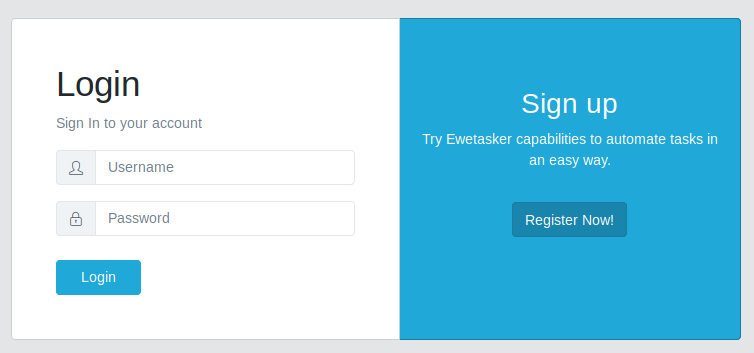

# EWE Tasker Web Client

This repository contains EWE Tasker Server module, written in Python.

## INSTALLATION

### REQUIREMENTS
In order to install Ewetasker web client, it is needed to have installed docker-compose. Follow this [link](https://docs.docker.com/compose/install/) if you need more information about it.

In addition, Ewetasker web client works with [Ewetasker server](https://lab.cluster.gsi.dit.upm.es/ewe/ewetasker_server), so you must to install and launch it first.

### STEP BY STEP

First of all, clone the git project locally and access to Ewetasker server directory.

```
$ git clone https://lab.cluster.gsi.dit.upm.es/ewe/ewetasker_webclient.git ewetasker_webclient
```

Once made it, access to ewetasker_webclient directory and launch docker-compose.

```
$ cd ewetasker_webclient
$ docker-compose up --build

```

When build process finishes, you can access to Ewetasker service in localhost:5000 to register and start to use it.




# License
   Copyright 2018 Sergio Muñoz López and Carlos A. Iglesias Fernández.

   Licensed under the Apache License, Version 2.0 (the "License");
   you may not use this file except in compliance with the License.
   You may obtain a copy of the License at

       http://www.apache.org/licenses/LICENSE-2.0

   Unless required by applicable law or agreed to in writing, software
   distributed under the License is distributed on an "AS IS" BASIS,
   WITHOUT WARRANTIES OR CONDITIONS OF ANY KIND, either express or implied.
   See the License for the specific language governing permissions and
   limitations under the License.